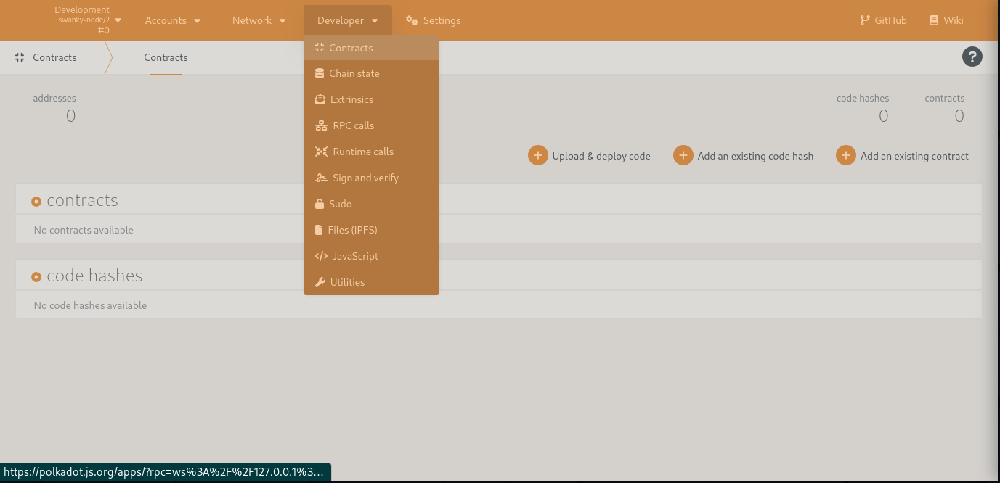
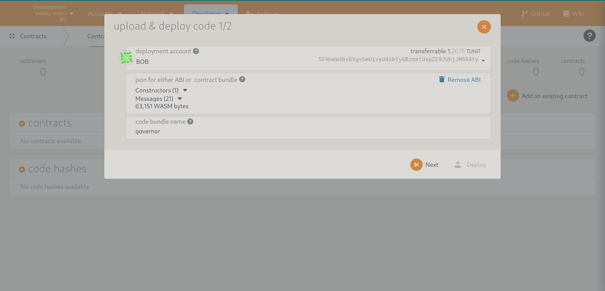
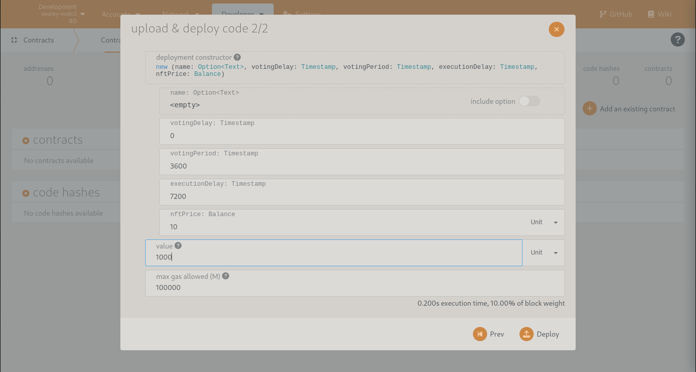
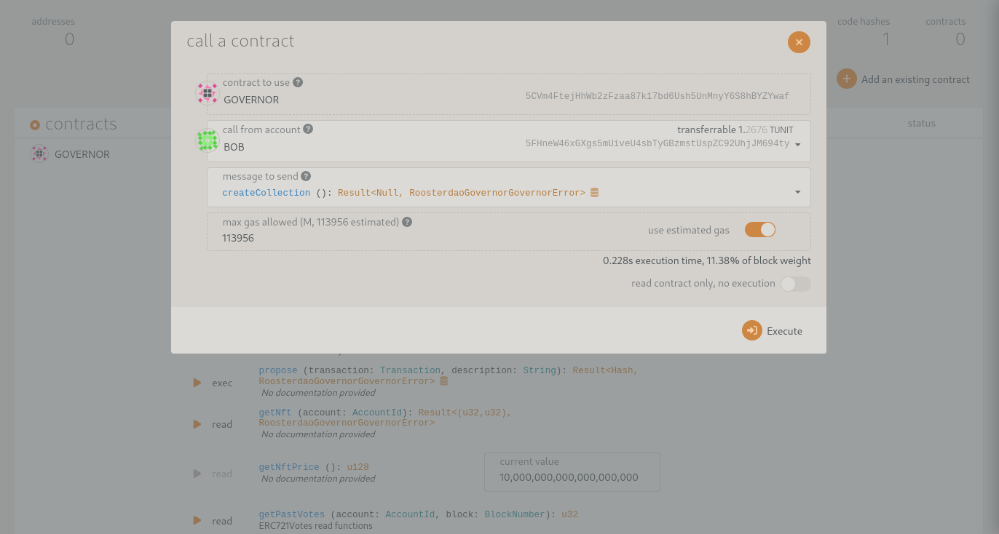
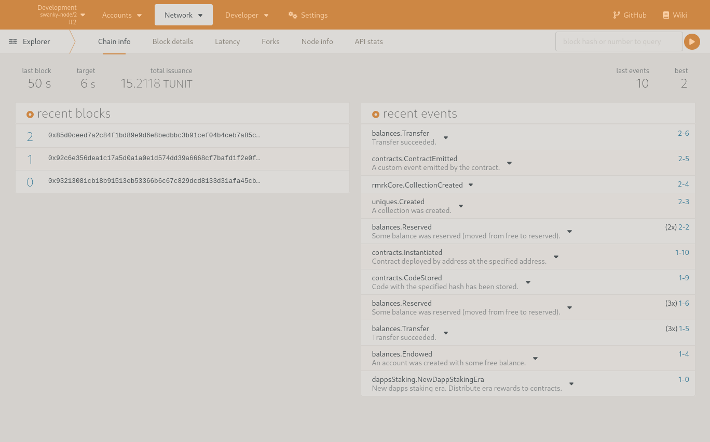

# Manual deploy

To deploy the contract manually, open the Developers⇾Contract section from the polkadot.js interface

Click on 'Upload & deploy code' and select the *./rooster-contracts/contracts/governor/target/ink/governor.contract* that was created by compiling the contract.

Click on *Next*. Here you can provide values for the constructor arguments. When you intend to use the Rooster DAO UI, these values can be left at default values, as the UI will create a new instantiation of the contract. If you want to test the contract manually, you can provide useful values here (Note that the unit for Timestamp values is second). The parameter named value specifies how many tokens are transferred from the caller to the contract, as the contracts needs resources (e.g. for minting) this cannot be left zero (or you should transfer a balance after instantiation of the contract).

## Manual test

If the contract was successfully instantiated, you can call its methods from the interface. The first method to be called is the *CreateCollection*

After creating the collection, you can verify the correct functioning of the contract by checking the events emitted

A next step would be for the current or other accounts to call *BecomeMember*. Note that this is a payable function, the minimum amount was specified during the instantiation of the contract.

All other functions can now be tested as well. Good Luck!
