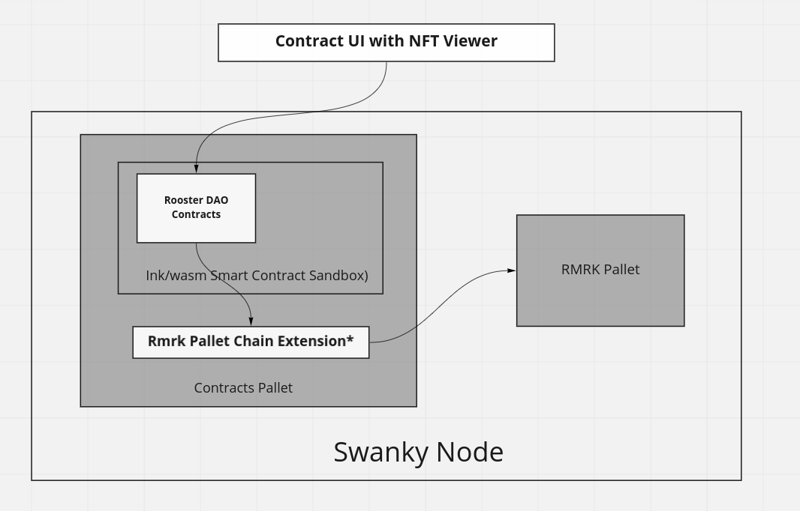

# rooster-swanky

## Introduction

This is the RoosterDao submission for the [Polkadot Hackathon North America edition 2022](https://polkadot-na.devpost.com/). It has been adapted for usage with Swanky node. More information on Rooster Dao [can be found here.](https://devpost.com/software/rooster-dao)

The setup of this project depends on 4 other projects:

* [Swanky-node](https://github.com/AstarNetwork/swanky-node)
* [Rooster DAO contracts](https://github.com/RoosterDao/rooster-contracts) *swanky-node* branch
* [Rooster DAO UI](https://github.com/RoosterDao/rooster-dao-ui)
* [Contract UI with NFT viewer](https://github.com/RoosterDao/contracts-ui-with-nft-viewer)

## Swanky-node

Plase follow the instructions on the [Swanky-node](https://github.com/AstarNetwork/swanky-node) Github page to compile the latest version of the node.

Afterwards, to run the fresh build node in development mode, you can issue the following:

    $ ./target/./target/release/swanky-node --dev
    2022-08-22 15:52:19 Swanky Node    
    2022-08-22 15:52:19 ✌️  version 0.9.1-9b1bdb793de    
    2022-08-22 15:52:19 ❤️  by Astar Network, 2022-2022    
    2022-08-22 15:52:19 📋 Chain specification: Development    
    2022-08-22 15:52:19 🏷  Node name: grumpy-question-0526    

You can verify the status of your node using the [polkadot.js explorer](https://polkadot.js.org/apps/?rpc=ws%3A%2F%2F127.0.0.1%3A9944#/explorer)

### Rooster Contracts

    $ cd examples/rooster-contract/
    $ cargo +nightly contract build
    ...
    Compiling governor v0.0.1 (/tmp/cargo-contract_ebdc4J)
    Compiling metadata-gen v0.1.0 (/tmp/cargo-contract_ebdc4J/.ink/metadata_gen)
    Finished release [optimized] target(s) in 38.05s
    Running `target/ink/release/metadata-gen ''`
    [5/5] Generating bundle
    
    Original wasm size: 116.0K, Optimized: 63.2K
    
    The contract was built in DEBUG mode.

    Your contract artifacts are ready. You can find them in:
    .../chain-extension-contracts/target/ink/rooster

     - rooster.contract (code + metadata)
     - rooster.wasm (the contract's code)
     - metadata.json (the contract's metadata)

 After successful completion the WASM contract is generated.

 Please use the [polkadot.js explorer](https://polkadot.js.org/apps/?rpc=ws%3A%2F%2F127.0.0.1%3A9944#/explorer) to [deploy the contract manually,](./Contract%20manual%20deploy.md) as this is needed in the following step.

### Rooster DAO UI

#### Setting up the repository

Initialize the submodules for the UI projects

    $ cd examples/rooster-ui
    $ git submodule init
    $ git submodule update

Please refer to the documentation of each project for a more detailed guidance on the building process.

As a first step you need to copy the contract *metadata.json* to the rooster-dao-ui application (from the root of this repo):

    $ cp target/ink/rooster/metadata.json examples/rooster-ui/rooster-dao-ui/rooster/lib/

To install and start the application:

    $ cd examples/rooster-ui/rooster-dao-ui/
    $ yarn install
    ...
    ➤ YN0009: │ sqlite3@npm:4.2.0 couldn't be built successfully (exit code 1, logs can be found here: /tmp/xfs-29e9858c/build.log)
    ➤ YN0007: │ rooster-dao-ui@workspace:. must be built because it never has been before or the last one failed
    ➤ YN0000: └ Completed in 24s 942ms
    ➤ YN0000: Failed with errors in 29s 781ms
    $ yarn start
      vite v2.9.9 dev server running at:

      > Local: http://localhost:8081/
      > Network: use `--host` to expose

      ready in 321ms.

Directing your browser to the above URL will allow you to use the Rooster DAO UI

### NFT Viewer

    $ cd contracts-ui-with-nft-viewer/
    $ yarn install
    ...
    ➤ YN0007: │ utf-8-validate@npm:5.0.9 must be built because it never has been before or the last one failed
    ➤ YN0007: │ contracts-ui@workspace:. must be built because it never has been before or the last one failed
    ➤ YN0000: └ Completed in 10s 718ms
    ➤ YN0000: Done with warnings in 12s 977ms
    $ yarn start
      vite v2.9.9 dev server running at:

      > Local: http://localhost:8082/
      > Network: use `--host` to expose

      ready in 395ms.

Directing your browser to the above URL will allow you to use the NFT viewer.
